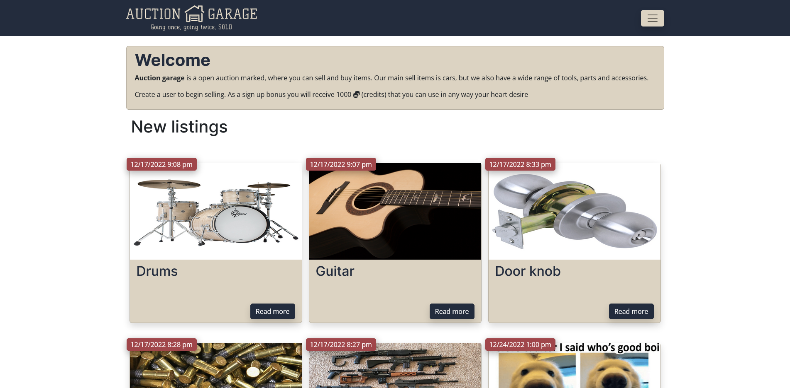

# Semester project
[](https://github.com/Christonn93/Semester-Project-2/actions/workflows/static.yml)


------

## Table of contents

1. [Project Brief](#project-brief)
2. [User stories](#user-stories)
3. [Tools used](#tools-used)
4. [Setting up](#setting-up)
  4.1 [Option 1](#option-1)
  4.2 [Option 2](#option-2)
  4.3 [Option 3](#option-3)
  4.4 [Starting the project](#starting-the-project)
5. [Hosting](#hosting)
6. [Contributing](#contributing)
7. [License](#license)
8. [Required links](#required-links)
9. [About and Contact](#about-and-contact)

------

## Project Brief

An auction site is looking to launch a website where users can add items to be bid on and bid on items other users have put up for auction.

When a new user joins the website, they are given 1000 credits to use on the site. They can get credits by selling items and use credit by buying items. Non-registered users can search through the listings, but only registered users can make bids on listings.

------

## User Stories

The project covers these user stories;

- A user with a stud.noroff.no email may register
- A registered user may log in
- A registered user may logout
- A registered user may update their avatar
- A registered user may view their total credit
- A registered user may create a Listing with a title, deadline date, media gallery and description
- A registered user may add a Bid to another user’s Listing
- A registered user may view Bids made on a Listing
- A registered user may use credit to make a Bid on another user’s Listing
- An unregistered user may search through Listings

------

## Tools used

- HTML 5
- Sass
- Bootstrap
- JavaScript
- Noroff Auction API

### Designed in

- Adobe XD (link to style tile and prototype at the end of the readme)

------

# Setting up

## Option 1

Download and extract the zip file or clone the project in the command line from your preferred editor.

```md
git clone https://github.com/Christonn93/Semester-Project-2.git
```

</br>

## Option 2

Use GitHub CLI

```md
gh repo clone Christonn93/Semester-Project-2
```

</br>

## Option 3

Open with GitHub Desktop

</br>

## Starting the project

After choosing one of the options above you will need to do the following

1. Install dependencies with:

    ```md
    npm i
    ```

</br>

2. Build page:

    ```md
    npm run build
    ```

</br>

3. View with Vite local server:

    ```md
    npm run dev
    ```

    This will open the option to view the page in the browser at: [http://127.0.0.1:5173](http://127.0.0.1:5173)

</br>

4. Watch changes to the style with:

   ```md
   npm run start
   ```

------

## Hosting

This project is using GitHub action to display the page on a [subdomain](https://auction-garage.christopher-tonnesland.no/). It will automatically push update the live site on push to main.

------

## Contributing

If you experience any errors feel free to add issues or open up a pull request with suggested changes. Likewise, if there are features you would like to suggest feel free.

------

## License

This project is licensed under a Creative Commons license. It is open for contributions, but please credit the project if you use the code in your projects.

------

## Required Links

<table>
  <thead>
    <tr>
      <th>Resource</th>
      <td>URL</td>
    </tr>
  </thead>
  <tbody>
    <tr>
      <th>Gantt Chart</th>
      <td><a href="https://docs.google.com/spreadsheets/d/1RwCNmC_BN5C3aZQhcwQwrIr3TtHjmNffUgCBWtsMbDE/edit#gid=0" target="_blank">Gantt Chart google sheets</a></td>
    </tr>
    <tr>
      <th>Design Prototype</th>
      <td><a href="https://xd.adobe.com/view/86332314-3f35-4ae0-8cff-1c4c1183261d-d360/" target="_blank">Desktop Prototype</a> </br>
      <a href="https://xd.adobe.com/view/d4fb7744-1648-4362-a14d-445f3494c655-81a8/" target="_blank">Mobile Prototype</a></td>
    </tr>
    <tr>
      <th>Style Guide</th>
      <td><a href="https://xd.adobe.com/view/69f09dc7-9e38-47c7-940b-56428cee7374-3ca3/" target="_blank">Style Guide</a></td>
    </tr>
    <tr>
      <th>Kanban Board</th>
      <td><a href="https://trello.com/invite/b/q1EZUyWP/ATTIe5fafbf1bc039f6d13382af9f3fb385aE35FAE4F/semester-project" target="_blank">Project Board Link</a></td>
    </tr>
    <tr>
      <th>Repository</th>
      <td><a href="https://github.com/Christonn93/Semester-Project-2" target="_blank">Project Repository</a></td>
    </tr>
    <tr>
      <th>Hosted Demo</th>
      <td>
        <a href="https://auction-garage.christopher-tonnesland.no/pages/user/dashboard/index.html">Website</a>
      </td>
    </tr>
  </tbody>
</table>

------

## About and Contact

The author of this project is Christopher Tønnesland

<div style="margin-bottom: 25px;">
<div align="center" style="display: flex; gap: 5px; flex-wrap: wrap;">
    <a href="mailto:christopher.tonnesland@gmail.com"></a>
    <a href="https://github.com/christonn"></a>
    <a href="https://wa.me/+4745481637"></a>
    <a href="https://linkedin.com/in/christopher tønnesland"></a>
    <a href="https://www.facebook.com/7oSkaaa"></a>
    <a href="https://codepen.io/christonn93" target="blank"></a>
</div>
</div>

------
